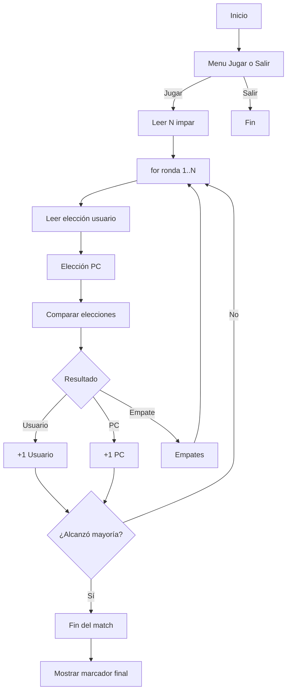

# Flujo principal

```mermaid
flowchart TD
  A[Inicio] --> B[Menu Jugar o Salir]
  B -->|Jugar| C[Leer N impar]
  B -->|Salir| Z[Fin]
  C --> D[for ronda 1..N]
  D --> E[Leer elección usuario]
  E --> F[Elección PC]
  F --> G[Comparar elecciones]
  G --> H{Resultado}
  H -->|Usuario| IU[+1 Usuario]
  H -->|PC| IP[+1 PC]
  H -->|Empate| IE[Empates]
  IU --> L{¿Alcanzó mayoría?}
  IP --> L
  IE --> D
  L -->|Sí| M[Fin del match]
  L -->|No| D
  M --> N[Mostrar marcador final]
```
